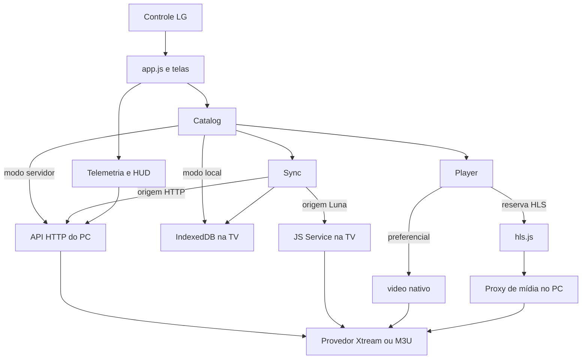

# Estado atual e arquitetura

> Registro do levantamento inicial (0.1.0). Para as mudanças de catálogo da versão 0.1.1, consulte [Prioridade 1 implementada](prioridade1-implementada.md), que prevalece sobre os trechos alterados deste documento.

## Identidade e contexto

Aplicativo `com.iptv.tvapp`, versão `0.1.0`, build interno `0911-1709`, empacotado para LG webOS. O README recebido registra medições na LG 43UP7500PSF, webOS 6.5.3, Chromium 79, painel 3840×2160 e viewport 1920×1080 com DPR 2. As medições antigas de memória, latência e limitações do overlay de vídeo são **relatos históricos do projeto**, não testes repetidos nesta análise.

O código próprio da interface usa JavaScript tradicional com callbacks e globais, HTML e CSS, sem framework ou compilação obrigatória. O backend do PC declara Node >=18 e não declara dependências npm. O serviço embutido usa `webos-service`, fornecido pelo ambiente webOS; os comentários apontam Node 8.12.0 como alvo. Um teste de sintaxe no Node 24 não valida esse alvo.

## Três partes, duas rotas de catálogo

`app/` contém o produto exibido na TV. `server/` mantém o catálogo em memória, credenciais/configurações no disco, proxy, validação e logs no PC. `services/` busca metadados na própria TV via Luna; não é um proxy de vídeo nem um servidor HTTP local.

### Inicialização

1. `index.html` carrega os scripts em ordem; `app.js` cria o Player para o elemento `video` e executa `boot`.
2. `Catalog.init` recupera modo e fonte de `localStorage`; `Log.install` instala a captura de erros; Luna consulta aparelho/rede; `Store.init` tenta registrar o kind DB8.
3. A lista virtual e o monitor são montados. A seção inicial sempre é `live`; não há restauração de último canal/categoria.
4. `resolveBackend` escolhe a preferência salva ou um IP privado fixo existente em `app.js` e solicita `/api/health`.
5. No modo servidor, carrega categorias e primeira página. No modo local, chama `Catalog.arrancar`: se houver canais, lê o banco; se estiver velho, inicia atualização; sem canais, sincroniza.

**Limitação importante:** até o modo local aguarda a tentativa inicial de health, que pode consumir os 15 s de timeout da API. Portanto, a intenção “abre na hora pelo banco” ainda não é verdadeira em todas as condições.

### Seleção de origem da sincronização

`Catalog.origem` tenta `ping` no JS Service com 12 s para tolerar a primeira inicialização. Só memoriza sucesso; falhas são tentadas novamente. Se o serviço responde, usa Luna. Se falta senha Xtream e existe base HTTP configurada, prefere o PC; `Catalog.sincronizar` também tenta obter a senha pela rota `/secret` e a salva em `localStorage` dentro de `iptv.fonteLocal`.

Ter `API.getBase()` preenchido é frequentemente usado como aproximação de “PC disponível”; não confirma disponibilidade real. Se o serviço responde ao ping e depois falha na busca, não há fallback automático geral daquela chamada para HTTP. A origem HTTP consulta a **fonte ativa global do backend**, não o `src.id` passado ao sincronizador.

## Funcionalidades realmente presentes

| Recurso | Situação | Evidência/limite |
|---|---|---|
| TV ao vivo M3U/iptv-org | Implementado | Download/cache/parser, categorias e player; cache compartilhado entre URLs é um defeito |
| Autenticação Xtream | Implementado | Status, formatos permitidos, expiração, conexões ativas/máximas |
| Live Xtream | Implementado | URLs e categorias normalizadas; sem validação massiva automática |
| Filmes Xtream | Implementado | Categorias primeiro, itens sob demanda; permite MP4/M3U8/TS por regra do app |
| Séries e episódios | Implementado | Lista de séries → temporadas agrupadas no retorno → episódios em lista única na UI |
| Fonte M3U própria | Backend e serviço implementados | Formulário da TV só cria Xtream; não há importador M3U na tela |
| Configuração pelo controle | Implementado | Backend, UA/Referer, teste/cadastro/ativação de fonte, modo, sync e diagnóstico |
| Modo local | Implementado com dependências residuais | IndexedDB + Luna; reserva hls.js e certos logos precisam do PC |
| Paginação e virtualização | Implementado | UI 120 itens/página, linhas 76 px, margem de 6 linhas; descarte de páginas distantes |
| Recuperação de reprodução | Implementado | Monitor por avanço temporal, fallback e retentativas limitadas |
| Busca | Infraestrutura parcial | `q` em HTTP/DB, sem campo de busca na interface principal |
| Favoritos | Estrutura somente | Store IndexedDB criada, sem jornada de adicionar/listar/remover |
| Histórico/retomada | Estrutura somente | Store criada; registros de telemetria não são retomada de vídeo |
| EPG | Não implementado no produto | `tvgId` e builder XMLTV existem, mas sem download/schema/rota/grade de programas |
| Catch-up | Metadados somente | Exibe indicação; não constrói reprodução por data/período |
| Áudio/legendas/qualidade | Não há seletor | hls.js/nativo usam o comportamento disponível do motor |
| Tela cheia, guia, home de pôsteres | Não implementados | Layout fixo: lista e área de vídeo |
| Transcode/remux | Ausentes | Não há FFmpeg no projeto local |
| Próximo episódio automático | Ausente | Não há tratamento de `ended` para sequência |
| Última categoria/canal | Ausente | Sempre inicia em live e índice 0 |

## Persistência e cache

### No PC

- `sources.json`: duas fontes recebidas; iptv-org inativa, Xtream ativa. Contém credenciais reais; não foram copiadas para a documentação.
- `config.json`: caminho previsto em `config.js`, mas arquivo não estava presente; defaults são usados até salvar.
- `playlist.m3u`: cache global de 6 h. Parser atual produz 392 canais/26 categorias e descarta 1 adulto pelo filtro M3U.
- `status.json`: 392 resultados antigos, 285 `ok` e 107 `dead`; o servidor escreve esse arquivo, mas não o recarrega na inicialização.
- CSVs: 31.208 registros de canais e 44.593 de feeds, excluídos os cabeçalhos; enriquecimento por `tvgId` e feed após `@`.
- Catálogo live, categorias VOD/séries e seus itens ficam em `STATE`. VOD/séries acumulam por categoria sem TTL/teto. Episódios acumulam até 5.000.
- Probes HLS em memória com validade 10 min; arquivos MP4 são sondados sem esse cache. Logos: cache em memória com validade 24 h e limite de 800 chaves, sem redimensionamento efetivo.
- `PLAYBACKS`: array em memória do processo. `/api/report` não recupera o histórico JSONL ao reiniciar.

### Na TV

Banco `iptv`, versão 1. Stores: `meta`, `sources`, `categories`, `live`, `vod`, `series`, `episodes`, `favorites`, `history`. Catálogo usa índices por fonte, posição e chave de categoria; episódios têm índice por série. A existência de uma store não significa que exista uma funcionalidade conectada à UI.

Escritas em lotes de 500, com uma transação por lote. A sincronização usa páginas de 400 via Luna e 500 via HTTP. `pos` é mantido para preservar ordem do provedor. As categorias usam chave `sourceId|type|catId`; os itens usam IDs `x`, `v`, `s`, `e` + ID externo, **sem a fonte na chave primária**, permitindo colisões entre fontes.

Preferências `iptv.backend`, `iptv.modo` e `iptv.fonteLocal` ficam em `localStorage`. `fonteLocal` inclui a senha. DB8 está disponível como tentativa de registro e método auxiliar `putChannels`, mas esse método não alimenta a lista atual; o catálogo efetivo é IndexedDB.

A sincronização live tem validade de 12 h no arranque. VOD/séries têm validade de 6 h por categoria. Episódios já encontrados são reutilizados sem expiração. Um sync completo regrava categorias com `carregadaEm:null`, invalidando a marca de carga de VOD/séries. Não remove categorias antigas nem itens VOD que desapareceram.

### No JS Service

Cache Xtream por URL, usuário, ação e categoria, TTL de 5 min, máximo de 12 entradas. O cache reduz downloads repetidos ao paginar respostas Luna; a API do provedor é baixada integralmente por coleção/categoria. Não é streaming incremental do JSON. M3U ainda é baixado e parseado novamente a cada página. O serviço encerra após o tempo ocioso configurado em 60 s.

O serviço cria um novo `XtreamProvider` a cada chamada. A autenticação que escolhe `allowed_output_formats` não é preservada nos métodos seguintes; eles voltam ao container padrão M3U8. Isso precisa de teste com conta somente TS.

## Reprodução e recuperação

`Catalog.play` produz uma decisão, e `Player.play` a executa. Live prioriza URL direta no `<video>`. HLS pode cair para hls.js pelo proxy do PC. TS bruto fica somente no nativo. Filmes/episódios não HLS usam nativo, `maxRetry:1`, prazo de 25 s se a sonda identifica `moov` no início e 45 s caso contrário. A regra que bloqueia MKV/AVI é uma política conservadora implementada; não comprova que todo arquivo nesses containers seja incompatível com todo modelo LG.

O monitor amostra a cada 250 ms. O “primeiro frame” é inferido quando `currentTime`, já positivo na amostra anterior, avança; não é captura de imagem. Limites de partida por `readyState`: 8/12/20/22/22 s, salvo prazo fixo. O parâmetro `startupMs:12000` fornecido no construtor em `app.js` não é utilizado pelo construtor atual. Travamento é ausência de avanço por mais de 2 s depois da partida, quando não pausado/encerrado.

Retentativas do app aguardam 1,5/3/4,5 s, com três por padrão. Primeiro avanço cancela o timer e zera o contador. hls.js tem sua própria camada de recuperação: rede fatal até três `startLoad`, erro de mídia com contador temporal, nudge e limites de buffer 20/30 s. O fallback só implementa nativo → hls.js; a possibilidade de retorno `fallback:'native'` da sonda não possui caminho simétrico no Player.

Há debounce de 350 ms para categoria, 400 ms para tocar e 500 ms para aquecer decisão de play do item em foco. Esse aquecimento é de metadados/sonda; **não pré-carrega o vídeo vizinho**. Faltam tokens de geração/cancelamento para impedir respostas antigas de alterar uma seleção nova.

## O ponto de parada reconstruído

As 39 cópias em 11 pastas de backup entre 09/09 e 11/09 mostram a transição: live/telemetria → filmes/séries sob demanda → ajustes de timeout para arquivos → banco local → serviço Luna → correção de normalização dupla, credenciais, paginação e arranque pelo banco. Os nomes das pastas registram o momento das cópias, não necessariamente o momento em que cada correção terminou.

O log recebido é posterior a esse avanço funcional: registra build `0911-1709`, catálogo local, navegação, quatro aberturas de séries e uma sincronização bem-sucedida via TV. Nas 15 reproduções encerradas, todas detectaram primeiro avanço, sem erro final; mediana de 4.001 ms nesses registros, motor nativo em todas. Há 17 eventos `firstframe`, 3 `stall`, 3 `retry` e 1 `startup`; os eventos excedem os playbacks encerrados porque há retentativas e sessão ainda aberta no fim. Não apresentar esse recorte como taxa universal de sucesso.

O IPK contém app e serviço: 28 arquivos, dos quais 27 puderam ser associados a caminhos locais. Seus JS estão minificados e 19 hashes diferem dos fontes, o que por si só não indica versão velha. O marcador do `app.js` empacotado também é `0911-1709`. Não foi demonstrada equivalência semântica completa entre o IPK e os fontes, nem consultado qual pacote está instalado atualmente na TV.

## Afirmações antigas que não devem guiar a retomada

O README original ainda chama Xtream/M3U de esqueleto, pede tela de backend e backoff, diz que senhas nunca chegam ao cliente e atribui AZUL ao HUD. Hoje Xtream já funciona, existe Settings, há backoff, existe `/secret`, AZUL abre Settings e AMARELO abre o HUD. A API não serve arquivos estáticos, apesar da sugestão antiga. “Favoritos e histórico no DB8” também não descreve a arquitetura nova: as stores previstas são no IndexedDB.
